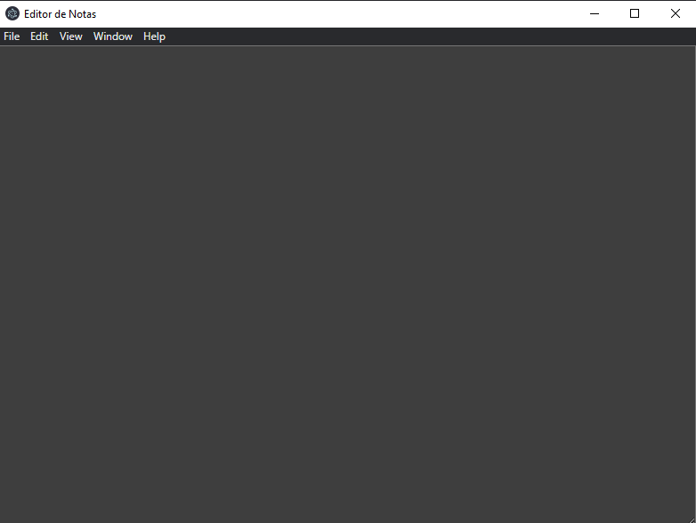

### Projeto de Editor de Texto com Electron.js
> Projeto para desenvolvimento de um editor de texto desktop

#### Interface

### Passos para uso
Em montagem

### Exemplo de uso
Em montagem

### Ambiente de Desenvolvimento
Em montagem

### Meta

Lucas Peixoto

Contato - lspeixoto

Projeto - 